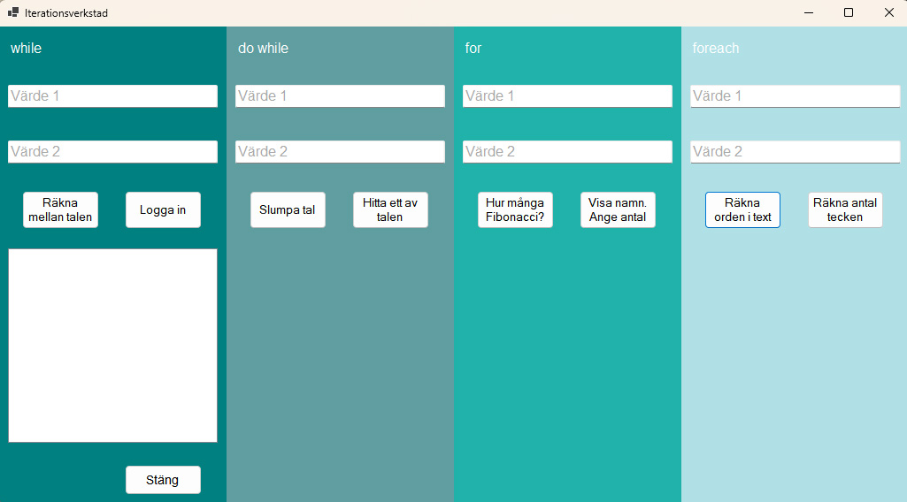

# Loopverkstad

## Beskrivning

Loop-och Metodverkstad är ett övningsprojekt skapat för att ge  praktisk erfarenhet av att arbeta med olika typer av loopar i C#. Gränssnittet är Windows Forms, och tillåter användare att experimentera med `while`, `do-while`, `for`, och `foreach` loopar, var och en kopplad till två specifika uppgifter.

## Gränssnitt

Gränssnittet består av fyra huvudsektioner, en för varje loop-typ. Varje sektion har två textfält för input och två knappar som aktiverar olika funktioner. Notera att användarinput endast valideras i `while`-sektionen; detta måste läggas till för de andra looparna av användaren.

 

## Uppgifter

Varje loop-sektion har följande uppgifter:

### while
- **Uppgift 1**: Skapa en räknare som ökar med 1 varje gång loopen körs. Användaren ska kunna ange ett startvärde och ett slutvärde. **Förväntat resultat**: Vid tryck på första knappen i formuläret ska varje steg av loopen visas i gränssnittet.

- **Uppgift 2**: Skapa en lista med minst fem användare, helst genom att antingen spara till en fil eller ännu bättre göra en egen klass. Om det är lite svårt, satsa då på två arrayer där den ena heter name och den andre password. Lägg till minst fem användare och deras lösenord, och väljer du två arrayer ska varje namns lösenord befinner sig på samma index-värde som i arrayen för lösenord. **Förväntat resultat**: Vid tryck på den andra knappen i formuläret ska efter lyckad inloggning hela listan av användare visas.

### do while
- **Uppgift 3**: Generera en slumpmässig lista med nummer. Användaren ska kunna ange ett specifikt värde, och loopen ska generera lika många nummer användaren vill ha. **Förväntat resultat**: Den första knappen i formuläret ska visa en slumpmässig lista med nummer, hur många ska vara beroende på vad användaren väljer.

- **Uppgift 4**: Från samma slumpmässig lista med nummer, ska användaren nu kunna ange ett specifikt värde (söka efter) och loopen ska köras tills det värdet hittas i listan. **Förväntat resultat**: Enbart det först hittade lika numret i listan ska visas (för att lista hur många gånger ett visst nummer förekommer i en lista, om det återkommer, passar en for-loop eller foreach bättre).

### for
- **Uppgift 5**: Skapa en funktion där användaren kan ange antalet element i en Fibonacci-sekvens som ska genereras. **Förväntat resultat**: Den första knappen i formuläret ska visa en genererad Fibonacci-sekvens (0, 1, 1, 2, 3, 5, 8, 13, 21, 34, 55, 89, etc) beroende på hur många element användaren vill se.

- **Uppgift 6**: Skapa en funktion som analyserar olika data ur tidigare genererad Fibonacci-sekvens. **Förväntat resultat**: Visa högsta och lägsta värdet, medelvärde, median, summan och antal element.

- **Uppgift 7**: Skapa ett enkelt bildgalleri där användaren kan ange hur många bilder de vill se (minst 1-5 bilder). Använd en for-loop för att ladda och visa det angivna antalet bilder från en fördefinierad lista eller katalog.

### foreach
- **Uppgift 8**: Användaren ska kunna mata in en textsträng. Använd en foreach loop för att räkna antalet förekomster av ord i strängen, och en annan för att räkna antal förekomster av tecken. **Förväntat resultat**: Användaren ska kunna se hur många ord och hur många tecken den egna inmatade texten innehåller.

- **Uppgift 9**: Skapa en tvådimensionell array som representerar en rutnätsstruktur, antingen att du matar in värden för hand i arrayen eller hellre att du använder två nästlade for-loopar för att fylla den. Resultatet kan vara något så enkelt som ett spelbräde (5x5 rutnät), en pixelbild, eller en annan matris med data. **Förväntat resultat**: datan visas i ditt formulär.

## Extra utmaningar (frivilligt)
### Fördjupning 1
Fördjupning dataanalys för specifikt uppgift 8/9: Låt säga att arrayen representerar en uppsättning av data med temperaturmätningar över tid och plats. Använd då foreach-loopar för att hitta högsta, lägsta, eller genomsnittliga värden i varje rad eller kolumn.
### Fördjupning 2
Lägg till funktioner, där så lämpar sig, där användaren kan filtrera ut vad det den vill se från en lista med innehåll. Det kan röra sig om att se alla som är inloggade vars namn (uppgift 2) börja på en viss bokstav, att kunna välja vilka bilder (uppgift 7) den vill se baserat på ett visst taggat ord för en viss bild, eller någon annan kul sortering. Använd gärna en drop-down meny (i Windows Forms kallas de för ComboBox).

## Användarinstruktioner

1. Klon repo: `git clone https://github.com/anvandarnamn/loop-och-metodverkstad.git`
2. Öppna lösningen i Visual Studio.
3. Kör projektet för att starta Windows Forms applikationen.
4. Ange värden i textfälten och interagera med de olika funktionerna via knapparna.

## Bidrag

För att bidra till projektet, följ dessa steg:

1. Forka repot.
2. Skapa en ny branch (`git checkout -b feature/AmazingFeature`).
3. Gör dina ändringar.
4. Commit dina ändringar (`git commit -m 'Add some AmazingFeature'`).
5. Push till branchen (`git push origin feature/AmazingFeature`).
6. Öppna en Pull Request.

## Licens

Detta projekt är licensierat under MIT-licensen - se `LICENSE`-filen för detaljer.
Projektlänk: https://github.com/anvandarnamn/loop-och-metodverkstad
